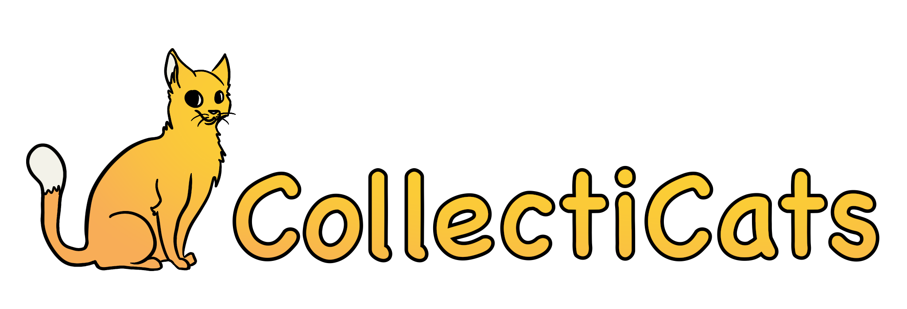

[](https://github.com/jeffrey-fontys/collecticats-front/actions/workflows/main.yml)
[](https://sonarcloud.io/summary/new_code?id=jeffrey-fontys_collecticats-front)  


CollectiCats is a web based collecting/trading game where players can collect virtual cats and trade them with each other. These cats have unique properties as a result of their genes. Try to collect as many special and rare cats as you can!

<!-- omit in toc -->
## Table of Contents
- [Running the CollectiCats front end](#running-the-collecticats-front-end)
  - [With Node Package Manager (NPM)](#with-node-package-manager-npm)
    - [Prerequisites](#prerequisites)
    - [Setting API URL](#setting-api-url)
    - [Installing dependencies (one-time)](#installing-dependencies-one-time)
    - [Starting up the front end](#starting-up-the-front-end)
    - [Shutting the front end down](#shutting-the-front-end-down)
  - [With Docker](#with-docker)
    - [Prerequisites](#prerequisites-1)
    - [Starting up the front end](#starting-up-the-front-end-1)
    - [Shutting the services down](#shutting-the-services-down)

## Running the CollectiCats front end

### With Node Package Manager (NPM)

#### Prerequisites

In order to run the CollectiCats front end with this route, please make sure that up-to-date versions of the following application(s) are installed on your system:

- Node
- Node Package Manager (NPM)

#### Setting API URL

In order for the software to run correctly on your system, you must supply the URL of the API backend gateway. Included in the project root directory is a `.env.example` file. To set the URL, remove the `.example` part of the filename on your system and enter your API URL into the file, as shown in the example below. Remember to save the file when you are done.

```
REACT_APP_API_URL="http://example:8080"
```

#### Installing dependencies (one-time)

Navigate to the root directory of the project with your terminal emulator and run the following command:

```
npm install
```

NPM will now start to download and install all the dependencies needed to run the front end application. You will generally only have to do this once. When it is finished, proceed to the next step.

#### Starting up the front end

Navigate to the root directory of the project with your terminal emulator and run the following command:

```
npm start
```

It is as simple as that. NPM should now run the script to start the front end application and will open it in your default web browser.

#### Shutting the front end down

Shutting down the front end is done by terminating the script running in your terminal emulator. On most systems, this is done by pressing `Ctrl + C`. The script will ask you to confirm by entering `Y` and then pressing return.

### With Docker

Use Docker to quickly set up the CollectiCats back end on your local machine or self-hosted server.  
[Read more about Docker here.](https://docs.docker.com/)

#### Prerequisites

In order to run the CollectiCats front end with this route, please make sure that up-to-date versions of the following application(s) are installed on your system:

- Docker Desktop  
*or*
- Docker Engine
- Docker CLI

#### Starting up the front end

Open your terminal emulator and run the following command:

```
docker run -e REACT_APP_API_URL="http://example:8080" -p 3000:3000 --name examplename --rm jeffreyfontys/collecticats-front:latest
```

Docker should now start pulling the latest CollectiCats image from Docker Hub and start it up when it is finished.

#### Shutting the services down

When you are finished using the CollectiCats front end application and wish to shut down the container, run the following command in a terminal emulator.

```
docker stop examplename
```
